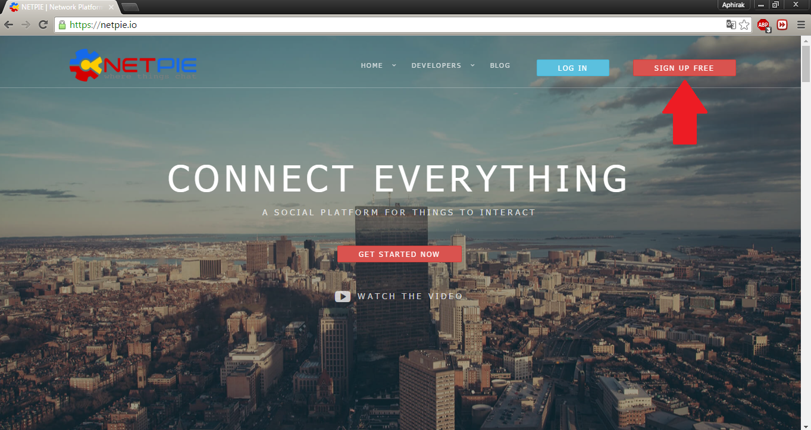

# NETPIE.io คืออะไร

  “NETPIE แพลตฟอร์ม IoT เพื่อนักพัฒนาและอุตสาหกรรมไทย” กระทรวงวิทยาศาสตร์และเทคโนโลยีโดย ศูนย์เทคโนโลยีอิเล็กทรอนิกส์และคอมพิวเตอร์แห่งชาติ(เนคเทค/สวทช.) ได้เปิดตัวแพลตฟอร์มสำหรับนักพัฒนาชาวไทย ซึ่ง NETPIE มีตัวย่อมาจาก  Network Platform for Internet of Everything โดยเป็นคลาวด์เซิร์ฟเวอร์ที่ให้บริการในรูปแบบ Platform as a Service สำหรับติดต่อสื่อสาร แลกเปลี่ยนข้อมูลระหว่างอุปกรณ์ต่าง ๆ เหมาะสำหรับการพัฒนาอุปกรณ์มี่เป็น IoT ในปัจจุบัน เช่น Arduino, Raspberry pi, ESP8266, HTML5, Node JS เป็นต้น NETPIE นั้นยังช่วยลดภาระด้านความปลอดภัยโดยผู้พัฒนาสามารถกำหนด หรือออกแบบได้เองทั้งหมด ดังนั้นแล้ว NETPIE จึงเป็นอีกทางเลือกหนึ่งสำหรับนักพัฒนา IoT ในยุคปัจจุบัน  

##ขั้นตอนการสมัครเข้าใช้งาน NETPIE.io
  1)เข้าไปยังเว็บไซด์ netpie.io จากนั้นคลิ๊กที่ SIGN UP FREE

  2)กรอกข้อมูลสำหรับใช้ในการสมัครให้เรียบร้อย แล้วคลิ๊ก SIGN UP
  

  3)รอรับข้อความยืนยันในโทรศัพท์จาก NETPIE โดยจะส่งข้อความเข้ามายังเบอร์โทรศัพท์ที่ได้ลงทะเบียนไว้
  
 
   4)เข้าหน้า LOG IN เพื่อทำการเข้าระบบ ให้ทำการกรอก ID ที่เราสมัคร และ Password ที่ได้จากข้อความในโทรศัพท์ลงไปแล้วกด LOG IN
   
   5)จากนั้นจะได้หน้า RESET Password ซึ่งให้เราใส่รหัสใหม่ของเรา เพื่อง่ายต่อการเข้าใช้งาน
 
   6)เมื่อทำการ Reset Password เสร็จ จะเข้าสู่หน้าหลักที่สามารถใช้งาน NETPIE.io ได้เรียบร้อย
